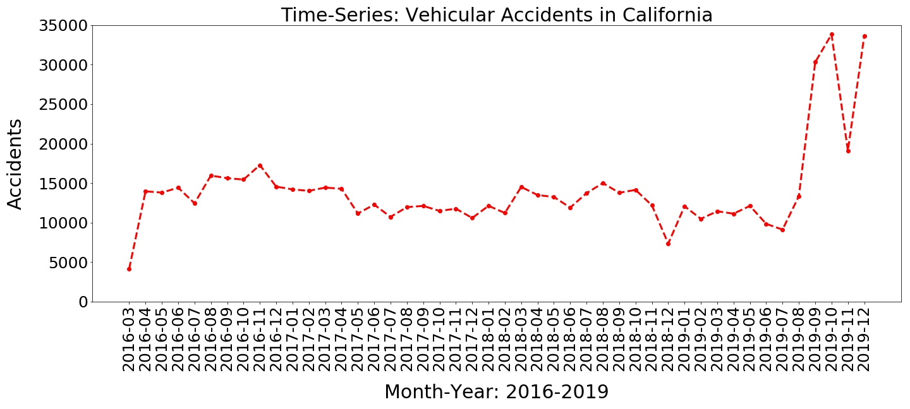

# Determining Severity of Vehicle Collisions in the U.S.

> by: [:globe_with_meridians: Mark Payumo](https://www.linkedin.com/in/markpayumo/)

Exploratory data analysis and machine learning model development of nationwide dataset on U.S. car accidents.

## Description

The **goal of this project** is to investigate trends in U.S. car accidents and use it to develop a machine learning regression model that will predict the likely severity of collision if it were to occur in a particular city. The severity is quantified within a range of **1 to 4** (1 being the least severe or least impact).

## Data Source

The dataset is a nationwide traffic accident record of 49 U.S. states between Feb. 2016 to Dec. 2019. It was obtained from Sobhan Moosavi, Srinivasan Parthasarathy, Mohammad Hossein Samavatian, Rajiv Ramnath, researchers from Ohio State University who wrote a [paper](https://arxiv.org/pdf/1906.05409.pdf) describing vehicle accidents in the country under a grant from the Ohio Supercomputer Center. The researchers purposely released the dataset to the public in order to democratize its utility for machine learning model development by interested individuals. It contains 49 features and 2,974,335 data points. You can find it [here](https://smoosavi.org/datasets/us_accidents).

## Exploratory Data Analysis

### U.S. Vehicular Accidents by State

### Top 20 Cities with Most Vehicular Accidents

---

### Day of Week

---

### Weather Conditions

Contrary to what would otherwise be popular intuition, most accidents occur during "fair winds, clear skies, and following seas."

---
## Model Development

>### Narrowing down to California

A spike in vehicular accidents impacted commuters in California towards the end of 2019.

---

###

## Conclusion

