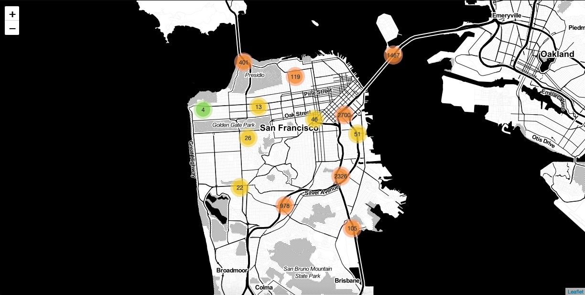

# Determining Severity of Vehicle Collisions in the U.S.

> by: [:globe_with_meridians: Mark Payumo](https://www.linkedin.com/in/markpayumo/)

Exploratory data analysis and machine learning model development of nationwide dataset on U.S. car accidents.

## Description

The **goal of this project** is to investigate trends in U.S. car accidents and use it to develop a machine learning regression model that will predict the severity of collision if it were to occur in a particular city. Severity is defined within a range of integers, **1 to 4** and which represent the following:
<ul><li>1 - Short Delay</li>
    <li>2 - Manageable Delay</li>
    <li>3 - Extended Delay</li>
    <li>4 - Long Delay</li></ul>

## Data Source

The dataset is a nationwide traffic accident record of 49 U.S. states between Feb. 2016 to Dec. 2019. It was obtained from Sobhan Moosavi, Srinivasan Parthasarathy, Mohammad Hossein Samavatian, Rajiv Ramnath, researchers from Ohio State University who wrote a [paper](https://arxiv.org/pdf/1906.05409.pdf) describing vehicle accidents in the country under a grant from the Ohio Supercomputer Center. The researchers purposely released the dataset to the public in order to democratize its utility for machine learning model development by interested individuals. It contains 49 features and 2,974,335 data points. You can find it [here](https://smoosavi.org/datasets/us_accidents).

## Exploratory Data Analysis

### U.S. Vehicular Accidents by State

California stands out as having the most share of traffic accidents followed by Texas, Florida, South Carolina, North Carolina, and upstate New York. The heatmap and bar graph show the magnitude of the frequency distribution.

### Top 20 Cities with Most Vehicular Accidents

The frequency distribution below quantifies the word cloud above.

---

### Day of Week

More traffic accidents occur during the weekdays.

---

### Weather Conditions

Contrary to what would otherwise be popular intuition, most accidents occur during "fair winds, clear skies, and following seas."

---
## Model Development

>### Narrowing down to California
>### 96 features and 645,967 data points

### Time Series Analysis: Car Accidents in California

A spike in vehicular accidents impacted commuters in California towards the end of 2019.

---

### Correlation Heatmap
>### Numerical features vis-á-vis Severity

Exploring how our features might satisfy the linearity assumption for linear regression, this heatmap shows five out of 96 features that have numerical values along with our target variable, "Severity." 

---

### Linear Regression
>### OLS (Ordinary Least Squares) Summary

The linear model performed poorly with an **adjusted R^2** of **0.089**. **Heteroscedascity** was also detected using the **Goldfeld-Quandt Test** with a **p-value** of <code>2.270459470776888e-10</code>, obtained through a subsample contingency that narrows down the dataset to car accidents that occurred in the City of San Francisco due to limitations in computing power. The same number of features were utilized when obtaining the p-value.

### Random Forest Regression
>### Feature importances and an improved R^2
> Limitations in computing power encouraged this project to model the subsample contingency that is narrowed down to San Francisco notwithstanding that the linear model was invalidated.
 
Random Forest Regression improved by more than twice the linear model with an **R^2 score** (SF) of <code>0.17945677024559692</code>. **Mean squared error** (SF) is <code>0.2093141614501258</code>. Feature importances are shown below that may provide for better modeling.

### Gradient Boosting Regression
>### Based on traffic accidents in San Francisco

Hyperparameters were set as follows:
<ul><li>Learning Rate = 0.11</li>
    <li>N Estimators = 100</li>
    <li>Max Depth = 4</li>
    <li>Subsample = 0.5</li></ul>
    
The model performed slightly worse than Random Forest with an **R^2 score** of <code>0.19156774891709116</code> and **mean squared error** is <code>0.20552179225176906</code>. The deviance plot below implies a need for further tuning and feature selection and engineering.

## Future Direction

Improved feature engineering, running models on the cloud especially with GridSearchCV will greatly develop this study, allowing it to run the full dataset. An AWS instance is currently being approved by Amazon, after which the models presented here will be uploaded and run on Sagemaker, and updated accordingly.

The map below will also be developed further with added computing power. Click [here](https://markg110.s3-us-west-1.amazonaws.com/map.html) to check which streets in San Francisco car accidents took place.

